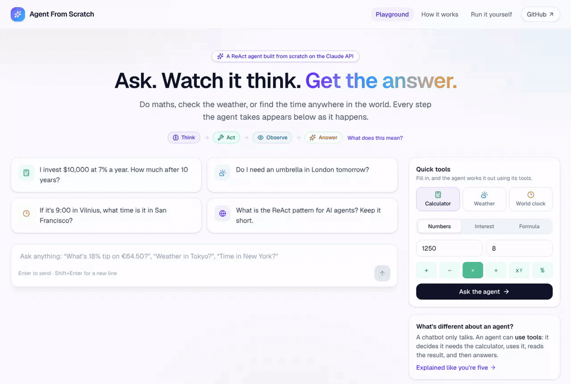
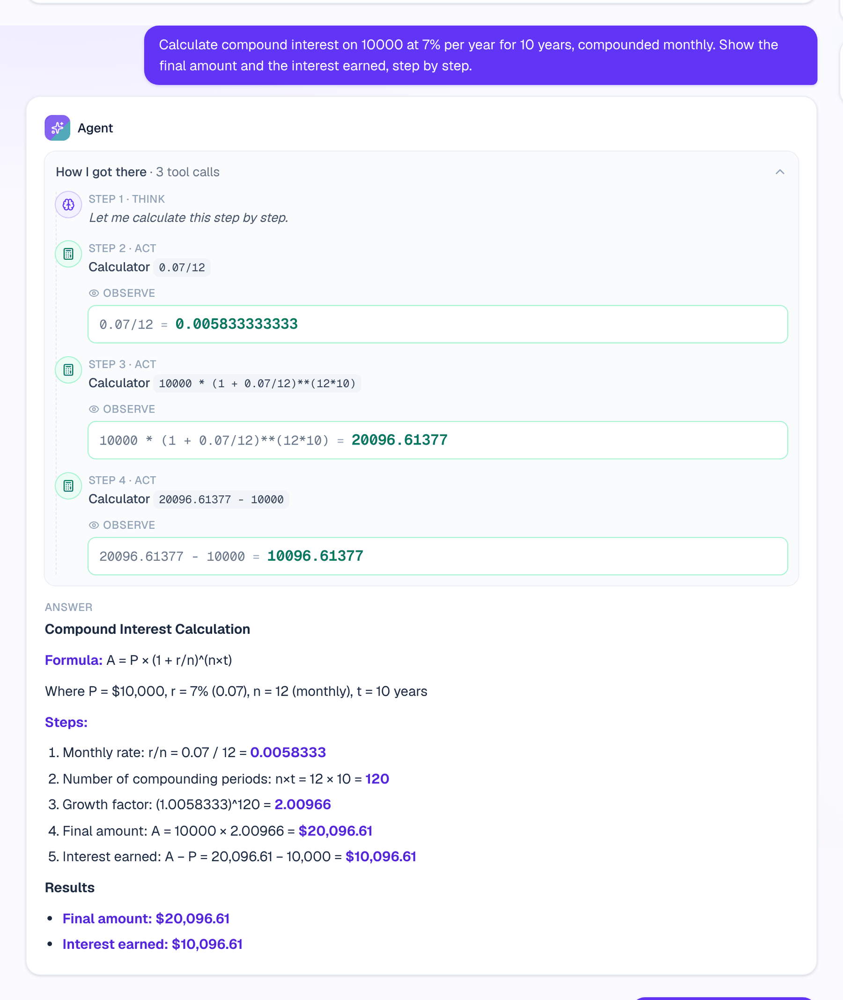
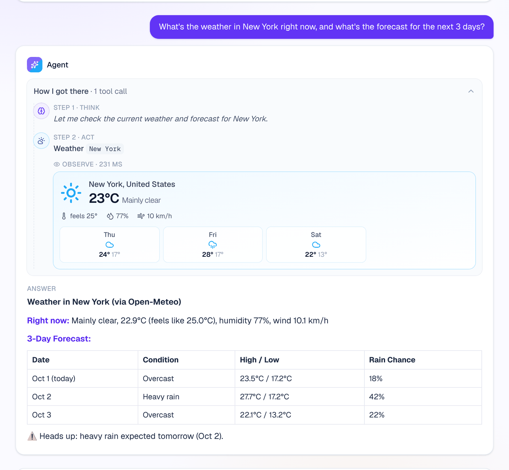
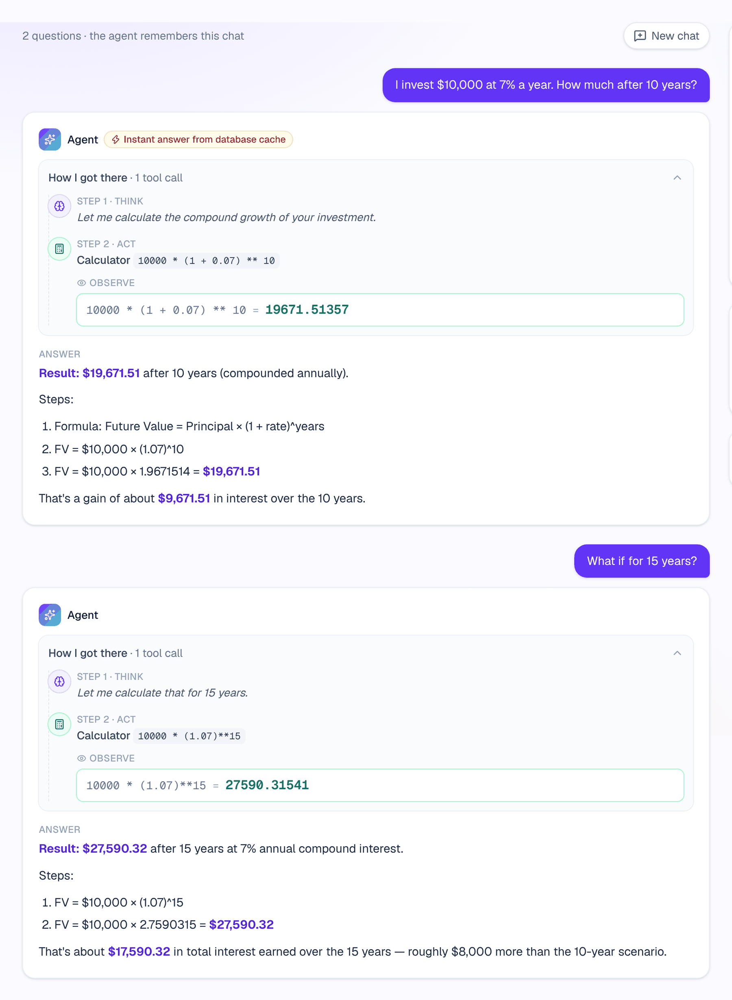
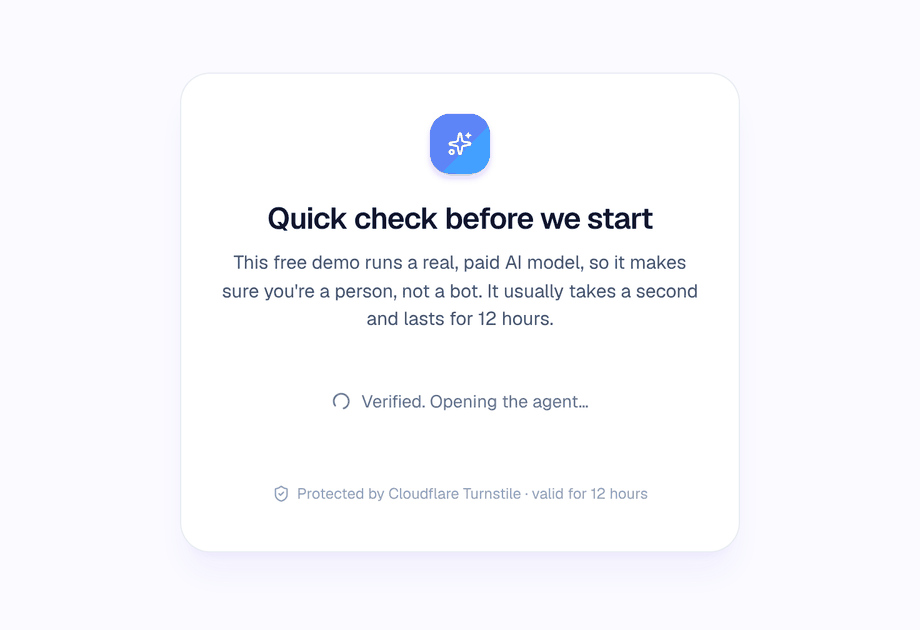
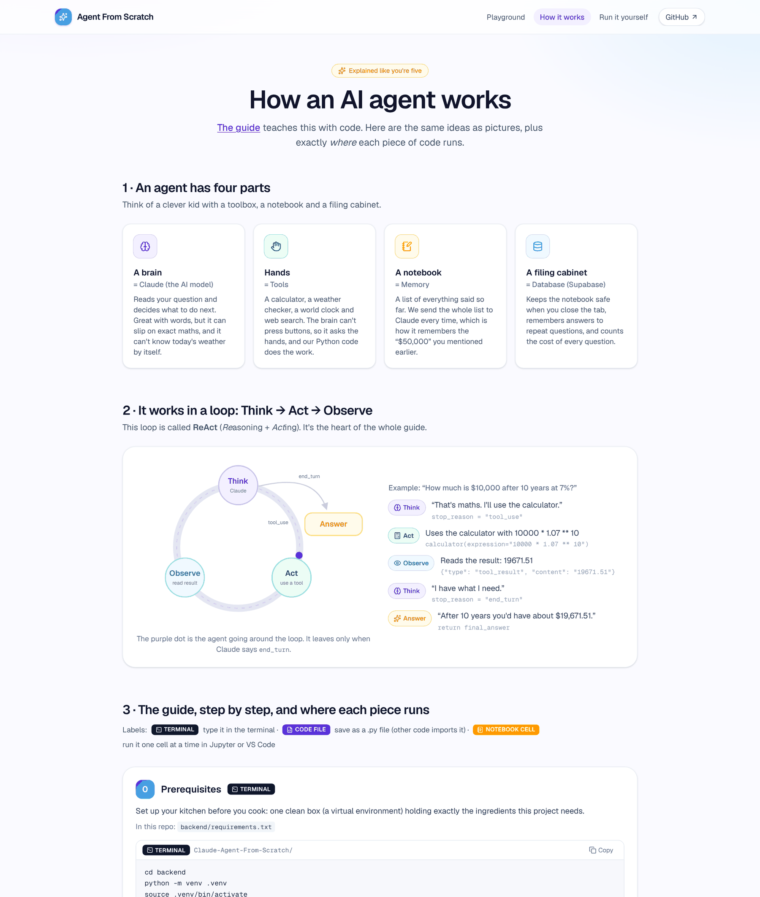
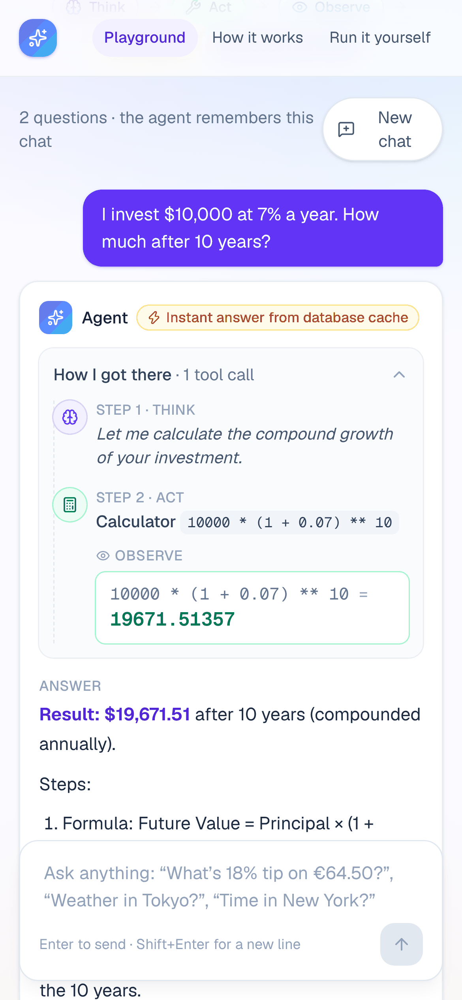
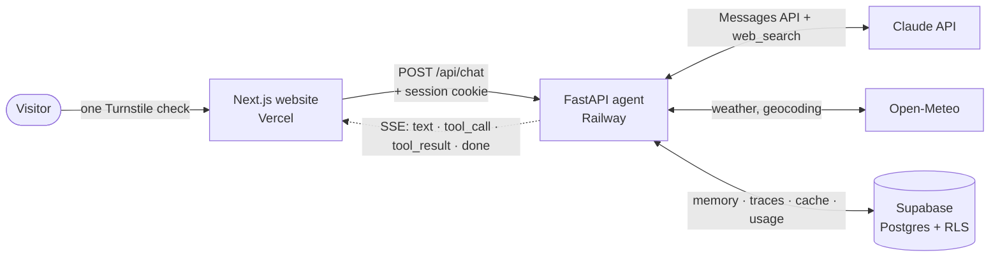
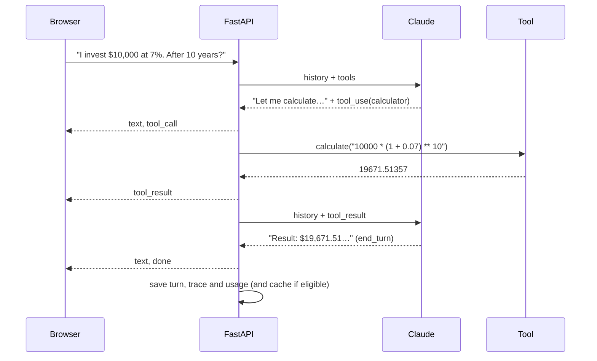

<div align="center">


# Claude Agent From Scratch

**Watch an AI agent think, use tools and answer, step by step.**<br/>
A ReAct agent hand-built on the Claude API, with no LangChain and no agent framework.

[**Try the live demo →**](https://agent.aurimas.io) &nbsp;·&nbsp; [How it works (ELI5)](https://agent.aurimas.io/how-it-works) &nbsp;·&nbsp; [Run it yourself](#quickstart)

[](https://agent.aurimas.io)
[](https://github.com/aurimas13/Claude-Agent-From-Scratch/actions/workflows/ci.yml)




<sub>A real answer from the live agent, replayed from its saved trace: one question, three calculator calls (two in parallel), then the answer.</sub>

</div>

## What it does

Ask anything and the agent works in a visible loop: **Think → Act → Observe → Answer**.

- **Maths**: compound interest, percentages, formulas. It always uses the calculator tool instead of doing arithmetic in its head.
- **Weather**: current conditions and a 3-day forecast for any city (Open-Meteo, no key needed).
- **World clock**: the local time anywhere, and time differences between cities.
- **Web search**: current facts with sources, via Anthropic's server-side tool.
- **Memory**: follow-up questions build on earlier ones, and a chat survives a page refresh (Supabase).

The site also has an **[explained-like-you're-five walkthrough](https://agent.aurimas.io/how-it-works)** of the [tutorial it started from](https://dev.to/dextralabs/how-to-build-an-ai-agent-from-scratch-using-claude-api-with-full-code-4b40). It turns each step into a picture and labels exactly where each code snippet runs: terminal, code file or notebook.

## Screenshots

All screenshots show real answers recorded by the live agent at [agent.aurimas.io](https://agent.aurimas.io).

<table>
  <tr>
    <td width="50%" valign="top">
      
      <p><b>Every step is visible.</b> The agent's thoughts, each tool call and each result appear live as a Think / Act / Observe timeline.</p>
    </td>
    <td width="50%" valign="top">
      
      <p><b>Real tools, rich results.</b> Tool output is shown as a card (weather, clocks, calculations, search results), not raw JSON.</p>
    </td>
  </tr>
  <tr>
    <td width="50%" valign="top">
      
      <p><b>Memory and an answer cache.</b> A follow-up like "What if for 15 years?" reuses earlier context. Repeated questions come back instantly from Postgres, at zero model cost.</p>
    </td>
    <td width="50%" valign="top">
      
      <p><b>One human check per visit.</b> Cloudflare Turnstile runs once before the site loads. After that, a signed 12-hour session cookie protects the paid API without slowing visitors down.</p>
    </td>
  </tr>
  <tr>
    <td width="50%" valign="top">
      
      <p><b>Explained like you're five.</b> The tutorial as pictures: the four parts of an agent, the ReAct loop, and where each piece of code runs.</p>
    </td>
    <td width="50%" valign="top" align="center">
      
      <p><b>Works on any screen.</b> The layout adapts down to phone width.</p>
    </td>
  </tr>
</table>

## Why it's built this way

| | |
|---|---|
| **Agent loop from scratch** | A hand-written ReAct loop over the Messages API: `tool_use` → run tools → `tool_result` → repeat until `end_turn`. It supports parallel tool calls and handles `pause_turn`, `max_tokens`, refusals and an iteration cap. |
| **Streaming, step by step** | Server-Sent Events carry every text delta, tool call and tool result to the browser while they happen. |
| **Safe, real tools** | A calculator that only accepts maths (no `eval`), Open-Meteo weather + geocoding + time zones, Anthropic web search, and a note tool with download. |
| **Persistent memory** | The full Claude message history lives in Postgres (Supabase). It's trimmed to a safe window that never orphans a `tool_result`. |
| **Answer cache** | A repeated first question that used no time-sensitive tool is answered from the database: instant, and no model cost. |
| **Human-verified sessions** | A one-time Turnstile check is exchanged for an HMAC-signed, HttpOnly, Secure, SameSite cookie. The chat API refuses requests without it. |
| **Cost and abuse controls** | Per-visitor rate limits, a daily USD budget cap read from a usage log, input caps and hashed IPs. See [SECURITY.md](SECURITY.md). |
| **Production hygiene** | Typed settings, 40 offline tests against a fake Claude stream, CI (ruff, pytest, eslint, tsc, build, gitleaks), Dependabot, a non-root Docker image and health checks. |

## The core loop

The heart of the project is [`backend/app/agent.py`](backend/app/agent.py), shown here simplified:

```python
for _ in range(max_iterations):
    async with client.messages.stream(model=MODEL, system=SYSTEM, tools=TOOLS, messages=history) as stream:
        async for event in stream:            # 1. THINK - stream Claude's words to the browser
            yield event
        response = await stream.get_final_message()
    history.append({"role": "assistant", "content": response.content})

    if response.stop_reason == "tool_use":    # 2. ACT - run every tool Claude asked for
        results = [await run_tool(b.name, b.input) for b in response.content if b.type == "tool_use"]
        history.append({"role": "user", "content": results})   # 3. OBSERVE - feed results back
        continue
    if response.stop_reason == "pause_turn":  # a long server-side web search: let Claude continue
        continue
    break                                     # 4. ANSWER - end_turn, max_tokens or refusal
```

## Architecture





| Layer | Tech |
|---|---|
| Agent API | Python 3.13, FastAPI, Anthropic SDK (async streaming), httpx, pydantic-settings |
| Website | Next.js 16 (App Router), React 19, Tailwind CSS 4, TypeScript |
| Data | Supabase Postgres with Row Level Security, reached over PostgREST |
| Hosting | Railway (Docker), Vercel, Cloudflare Turnstile, Namecheap DNS |
| Quality | pytest, ruff, eslint, tsc, GitHub Actions, gitleaks, Dependabot |

## Quickstart

You need Python 3.12+, Node 20+ and an [Anthropic API key](https://console.anthropic.com/). Supabase and Turnstile are optional locally: without them, memory lives in RAM and the human check is skipped.

```bash
git clone https://github.com/aurimas13/Claude-Agent-From-Scratch.git
cd Claude-Agent-From-Scratch
make setup                 # venv + pip + npm, copies the .env examples
# put ANTHROPIC_API_KEY=... in backend/.env

make cli                   # 1) chat in the terminal
make api                   # 2) API on :8000  (separate tab)
make web                   # 3) website on :3000 (separate tab)
make test                  # lint + 40 tests + type checks
```

<details>
<summary>Without make</summary>

```bash
# Terminal 1 - backend
cd backend
python3 -m venv .venv && source .venv/bin/activate
python -m pip install -e ".[dev]"
cp .env.example .env              # add ANTHROPIC_API_KEY
python -m app.cli                 # terminal chat, or:
uvicorn app.main:app --reload --port 8000

# Terminal 2 - frontend
cd frontend
npm install && cp .env.example .env.local
npm run dev                       # http://localhost:3000
```
</details>

Prefer one step at a time? [`notebooks/walkthrough.ipynb`](notebooks/walkthrough.ipynb) follows the tutorial cell by cell.

## Deploy

| Piece | Where | Steps |
|---|---|---|
| Database | **Supabase** | New project → SQL Editor → run [`supabase/migrations/20261001000000_init.sql`](supabase/migrations/20261001000000_init.sql) → copy the project URL and a **Secret key** (`sb_secret_…`). |
| Agent API | **Railway** | New project from this repo. Set Root Directory to `/backend` and Config File to `/backend/railway.json` (Docker build + `/api/health` check). Add the variables from [`backend/.env.example`](backend/.env.example) with `ENVIRONMENT=production`, `ALLOWED_ORIGINS=https://your-site` and a random `IP_HASH_SALT`. |
| Bot check | **Cloudflare Turnstile** | Add a widget (Managed) for your site's domain. The site key goes to Vercel, the secret key to Railway. |
| Website | **Vercel** | Import the repo with Root Directory `frontend`. Set `NEXT_PUBLIC_API_URL` and `NEXT_PUBLIC_TURNSTILE_SITE_KEY`, then add your domain. |
| DNS | **Your registrar** | Add the custom domains in Railway and Vercel first, then create the CNAME (and TXT) records they show. |

Set a monthly spend limit in the Anthropic Console too, as a final backstop.

## Project structure

```
backend/                 Python agent (FastAPI)
  app/agent.py           the ReAct loop, streaming events
  app/tools/             calculator · weather · world time · notes (+ web_search spec)
  app/main.py            API: sessions, SSE chat, memory, cache, usage, limits
  app/security.py        rate limiter, Turnstile, signed sessions, IP hashing
  app/store/             Supabase (httpx/PostgREST) + in-memory store
  app/cli.py             terminal chat
  tests/                 40 tests with a fake Claude stream (no network)
frontend/                Next.js 16 + Tailwind 4
  app/                   Playground · How it works (ELI5) · Run it yourself
  components/            HumanGate, Turnstile, playground (chat, timeline, tool cards, quick tools)
supabase/migrations/     schema + RLS + usage function
notebooks/               the tutorial, cell by cell
docs/                    screenshots and demo media
```

## From the tutorial to this project

| Tutorial step | What the tutorial does | What changed here, and why |
|---|---|---|
| 1 · Setup | `anthropic.Anthropic(api_key=…)` | Async client from typed settings. A workspace ID, if needed, is sent as a header (the client has no `workspace_id` argument). |
| 2 · Tools | `eval()` calculator, simulated search, `save_to_file` | AST calculator with limits, real weather and time, Anthropic web search, `save_note` to the database. Tools are passed as a bare list, because wrapping them in an object returns a 400. |
| 3 · Loop | `run_agent()` with `end_turn` / `tool_use` | Streaming events, parallel tool calls, `pause_turn` continuation, `max_tokens` and refusal handling, and a final branch so unexpected stop reasons can't loop. |
| 4 · Run | prints to the console | Terminal CLI, live web UI and notebook. |
| 5 · Memory | recursive `self.chat("")` | The API rejects that empty message, so a bounded loop replaces the recursion. History lives in Supabase, trimmed to a safe window. |

## Lessons learned

The full story is on the [How it works](https://agent.aurimas.io/how-it-works) page.

1. **`ModuleNotFoundError` after `pip install`** means pip installed into one interpreter (conda base) while `python` ran another. Use one venv per project and `python -m pip`.
2. **`tools: Input should be a valid array`**: tool JSON files often wrap the list in an object, but the API wants the bare list.
3. **An `else: return` one indent too deep** ended the agent whenever Claude spoke before calling a tool. Branch on `stop_reason`, not on content blocks.
4. **Never `eval` model output.** A small AST evaluator is safer and just as capable.
5. **Configuration bugs look like outages.** A Supabase URL saved with `/rest/v1` on the end crashed the API before Claude was ever called. The store now accepts both forms, and storage failures return a clear 503.
6. **A public LLM demo needs a wallet guard and a bot check.** A daily budget cap read from a usage log, plus one Turnstile check per visit, keeps it cheap without annoying visitors.

## Configuration

All settings are environment variables. See [`backend/.env.example`](backend/.env.example) and [`frontend/.env.example`](frontend/.env.example).
The main ones: `MODEL`, `MAX_TOKENS`, `MAX_ITERATIONS`, `WEB_SEARCH_MAX_USES`, `RATE_LIMIT_PER_MINUTE`, `RATE_LIMIT_PER_DAY`, `DAILY_BUDGET_USD`, `SESSION_TTL_HOURS`, `CACHE_TTL_HOURS` and `PRICE_*` (cost estimates).

## Roadmap

- [ ] Prompt-cache the tool definitions as well as the system prompt
- [ ] Redis-backed rate limiting for multi-instance deploys
- [ ] Evals: a regression suite of questions with expected tool calls
- [ ] Optional sign-in (Supabase Auth) for higher personal limits

## Credits

- Original tutorial: [How to Build an AI Agent from Scratch Using Claude API](https://dev.to/dextralabs/how-to-build-an-ai-agent-from-scratch-using-claude-api-with-full-code-4b40) by Dextra Labs
- Weather and geocoding: [Open-Meteo.com](https://open-meteo.com/) (CC BY 4.0)
- Built by [Aurimas](https://aurimas.io). This is my second agent, after the minimalist [Calculator-Agent](https://github.com/aurimas13/Calculator-Agent).

MIT licensed. Security reports: see [SECURITY.md](SECURITY.md).
