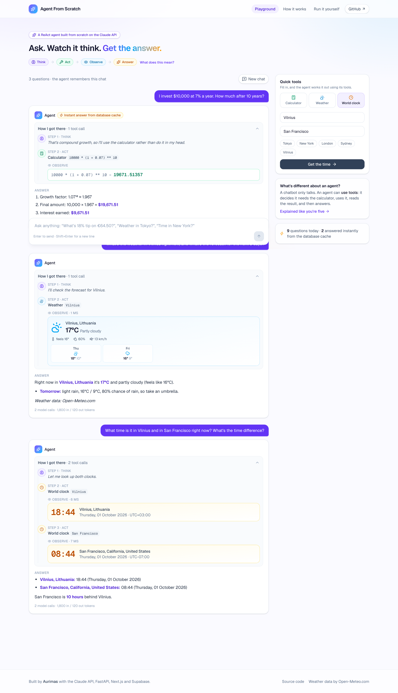
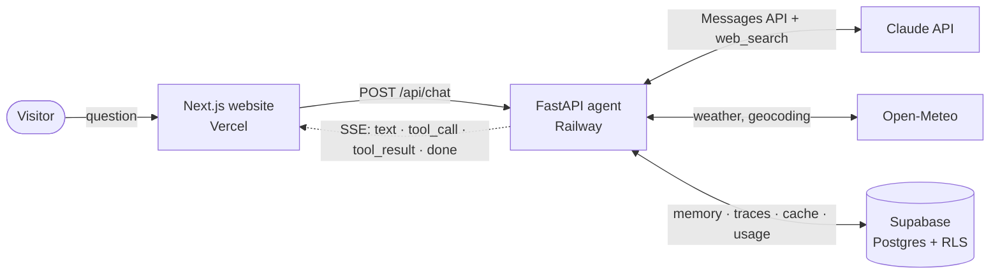
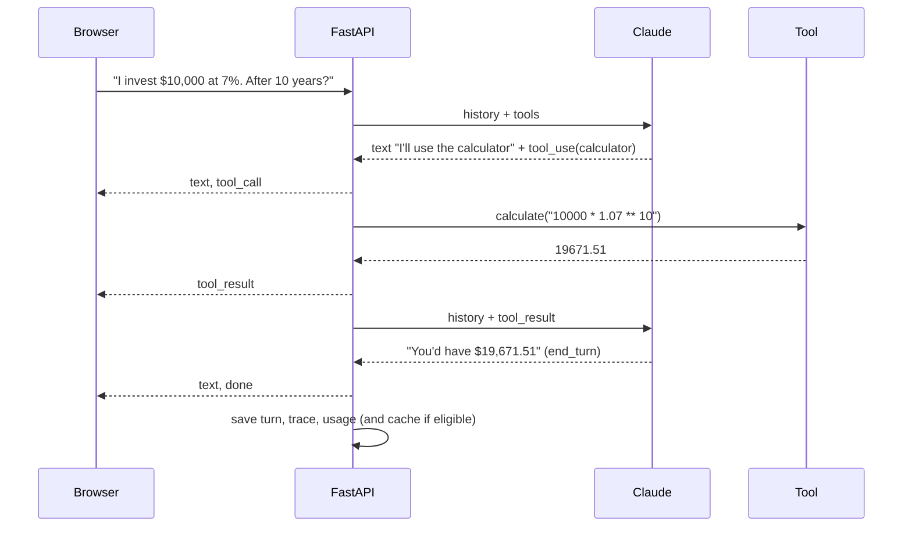

<div align="center">

# Claude Agent From Scratch

**A ReAct AI agent built from first principles on the Claude API. No agent frameworks. Every step it takes streams live to the page.**

[Live demo](https://agent.aurimas.io) · [How it works (ELI5)](https://agent.aurimas.io/how-it-works) · [Run it yourself](#quickstart)

[](https://github.com/aurimas13/Claude-Agent-From-Scratch/actions/workflows/ci.yml)




</div>

## What it does

Ask a question and watch the agent **think → act → observe → answer**:

- **Maths**: compound interest, percentages, formulas. It always uses a calculator tool instead of doing arithmetic in its head.
- **Weather**: current conditions and a 3-day forecast for any city (Open-Meteo, no key).
- **World clock**: the local time anywhere, and time differences between cities.
- **Web search**: current facts with sources (Anthropic's server-side tool).
- **Memory**: follow-up questions build on earlier ones, and chats survive a page refresh (Supabase).

The site also includes an **[explained-like-you're-five walkthrough](https://agent.aurimas.io/how-it-works)** of the [original guide](https://dev.to/dextralabs/how-to-build-an-ai-agent-from-scratch-using-claude-api-with-full-code-4b40). It shows each step as a picture and labels exactly *where* each code snippet runs: terminal, code file or notebook.

## Highlights

| | |
|---|---|
| **Agent loop from scratch** | A hand-written ReAct loop over the Messages API: `tool_use` → run tool → `tool_result` → repeat until `end_turn`. It handles `pause_turn`, `max_tokens`, refusals and an iteration cap. |
| **Live step-by-step UI** | Server-Sent Events stream every text delta, tool call and tool result. The UI shows them as a *Think / Act / Observe* timeline with rich cards for weather, clocks, calculations and search results. |
| **Real tools** | Calculator that only accepts maths (no `eval`), Open-Meteo weather + geocoding + time zones, Anthropic web search, and save-note with download. |
| **Persistent memory** | Full Claude message history in Postgres (Supabase), trimmed to a safe window that never orphans a `tool_result`. |
| **Answer cache** | A repeated first question that used no time-sensitive tools is answered from the database instantly, at zero cost. |
| **Cost and abuse controls** | Rate limits, Cloudflare Turnstile, a daily USD budget cap from a usage log, input caps and hashed IPs. See [SECURITY.md](SECURITY.md). |
| **Production hygiene** | Typed settings, 37 offline tests with a fake Claude stream, a CI pipeline (ruff, pytest, eslint, tsc, build, gitleaks), Dependabot, a non-root Docker image and health checks. |

## Architecture





## Quickstart

You need Python 3.12+, Node 20+ and an [Anthropic API key](https://console.anthropic.com/). Supabase is optional locally: without it, memory lives in RAM.

```bash
git clone https://github.com/aurimas13/Claude-Agent-From-Scratch.git
cd Claude-Agent-From-Scratch
make setup                 # venv + pip + npm, copies the .env examples
# put ANTHROPIC_API_KEY=... in backend/.env

make cli                   # 1) chat in the terminal
make api                   # 2) API on :8000  (separate tab)
make web                   # 3) website on :3000 (separate tab)
make test                  # lint + 37 tests + type checks
```

<details>
<summary>Without make</summary>

```bash
# Terminal 1 - backend
cd backend
python3 -m venv .venv && source .venv/bin/activate
python -m pip install -e ".[dev]"
cp .env.example .env              # add ANTHROPIC_API_KEY
python -m app.cli                 # terminal chat, or:
uvicorn app.main:app --reload --port 8000

# Terminal 2 - frontend
cd frontend
npm install && cp .env.example .env.local
npm run dev                       # http://localhost:3000
```
</details>

Prefer working one step at a time? Open [`notebooks/walkthrough.ipynb`](notebooks/walkthrough.ipynb). It follows the guide cell by cell.

## Deploy

| Piece | Where | Steps |
|---|---|---|
| Database | **Supabase** | New project → SQL Editor → run [`supabase/migrations/20261001000000_init.sql`](supabase/migrations/20261001000000_init.sql) → copy the project URL + a **Secret key** (`sb_secret_…`). |
| Agent API | **Railway** | New project from this repo, root directory `/backend` (uses the `Dockerfile` + `railway.json` health check). Set the variables from [`backend/.env.example`](backend/.env.example) with `ENVIRONMENT=production`, `ALLOWED_ORIGINS=https://agent.aurimas.io` and a random `IP_HASH_SALT`. |
| Bot check | **Cloudflare Turnstile** | Add a widget for your domain. The site key goes to Vercel, the secret to Railway. |
| Website | **Vercel** | Import the repo, root directory `frontend`, set `NEXT_PUBLIC_API_URL` to the Railway URL and `NEXT_PUBLIC_TURNSTILE_SITE_KEY`. Add the `agent.aurimas.io` domain. |

Also set a monthly spend limit in the Anthropic Console as a final backstop.

## Project structure

```
backend/                 Python agent (FastAPI)
  app/agent.py           the ReAct loop, streaming events
  app/tools/             calculator · weather · world time · notes (+ web_search spec)
  app/main.py            API: SSE chat, memory, cache, usage, limits
  app/security.py        rate limiter, Turnstile, IP hashing
  app/store/             Supabase (httpx/PostgREST) + in-memory store
  app/cli.py             terminal chat
  tests/                 37 tests with a fake Claude stream (no network)
frontend/                Next.js 16 + Tailwind 4
  app/                   Playground · How it works (ELI5) · Run it yourself
  components/playground/ chat, step timeline, tool cards, quick tools
supabase/migrations/     schema + RLS + usage function
notebooks/               the guide, cell by cell
```

## From the guide to this project

| Guide step | What the guide does | What changed here, and why |
|---|---|---|
| 1 · Setup | `anthropic.Anthropic(api_key=…)` | Async client from typed settings. A workspace ID, if needed, is sent as a header (the client has no `workspace_id` argument). |
| 2 · Tools | `eval()` calculator, simulated search, `save_to_file` | AST calculator with limits, real Open-Meteo weather/time, Anthropic web search, `save_note` to the DB. The tools list is passed as a list, not wrapped in an object (a 400 otherwise). |
| 3 · Loop | `run_agent()` with `end_turn` / `tool_use` | Streaming events, `pause_turn` continuation, `max_tokens`/refusal handling, and an `else` branch so unexpected stop reasons can't loop. |
| 4 · Run | prints to the console | Terminal CLI, a live web UI and a notebook. |
| 5 · Memory | recursive `self.chat("")` | The empty-message recursion is rejected by the API, so it's replaced with a bounded loop. History lives in Supabase and is trimmed to a safe window. |

## Lessons learned

The full story is on the [How it works](https://agent.aurimas.io/how-it-works) page. In short:

1. **`ModuleNotFoundError` after `pip install`** happens when pip installs into one interpreter (conda base) and `python` runs another. The fix is a per-project venv and `python -m pip`.
2. **`tools: Input should be a valid array`**: JSON tool files often wrap the list in an object, and the API wants the bare list.
3. **An `else: return` one indent too deep** ended the agent whenever Claude narrated before a tool call. Branch on `stop_reason`, not on content blocks.
4. **Never `eval` model output.** A 40-line AST evaluator is safer and just as capable.
5. **Public LLM demos need a wallet guard.** A daily budget cap read from a usage log is easy to build and very worth having.

## Configuration

All settings are environment variables. See [`backend/.env.example`](backend/.env.example) and [`frontend/.env.example`](frontend/.env.example).
Main knobs: `MODEL`, `MAX_TOKENS`, `MAX_ITERATIONS`, `WEB_SEARCH_MAX_USES`, `RATE_LIMIT_PER_MINUTE`, `RATE_LIMIT_PER_DAY`, `DAILY_BUDGET_USD`, `CACHE_TTL_HOURS`, `PRICE_*` (for cost estimates).

## Roadmap

- [ ] Prompt-cache the tool definitions as well as the system prompt
- [ ] Redis-backed rate limiting for multi-instance deploys
- [ ] Evals: a small regression suite of questions with expected tool calls
- [ ] Optional sign-in (Supabase Auth) for higher personal limits

## Credits

- Original tutorial: [How to Build an AI Agent from Scratch Using Claude API](https://dev.to/dextralabs/how-to-build-an-ai-agent-from-scratch-using-claude-api-with-full-code-4b40) by Dextra Labs
- Weather and geocoding: [Open-Meteo.com](https://open-meteo.com/) (CC BY 4.0)
- Built by [Aurimas](https://aurimas.io). This is my second agent, after the minimalist [Calculator-Agent](https://github.com/aurimas13/Calculator-Agent).

MIT licensed.
